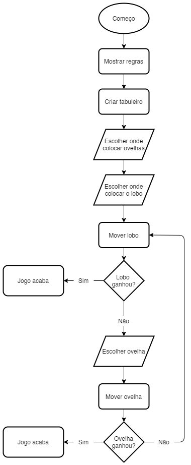

# LP1_P1 - Wolf & Sheep

## Autoria

### Grupo

Afonso Rosa - a21802169  
André Vitorino - a21902663  

### Distribuição

#### Afonso Rosa

O aluno, Afonso Rosa, foi o responsável pelas classes `Sheep.cs`, `Wolf.cs`,
`VictoryConditions.cs` e `IntroRules.cs`, tendo sido o responsável pela lógica,
estruturação e funcionamento das mesmas, embora isto não tenha sido obtido sem
o apoio direto do colega, André Vitorino, que otimizou o funcionamento das
classes.

O aluno também ajudou na estruturação lógica da class `Program.cs` embora não
tenha sido o principal responsável.

Tratou ainda da documentação das classes pelas quais foi o responsável,
tendo confirmado com o colega a credibilidade da mesma.

#### André Vitorino

O aluno, André Vitorino, foi o responsável pelas classes `Board.cs` e
`Program.cs`, tendo sido o responsável pela lógica, estruturação e funcionamento
das mesmas.

O aluno fez ainda pequenas otimizações e o algoritmo para ver os vizinhos de
uma peça no tabuleiro de jogo.

Tratou ainda da estruturação e lógica do programa como um todo e da documentação
das classes pelas quais foi o responsável. Também ajudou o colega, Afonso Rosa,
no funcionamento das suas classes e verificou a documentação das mesmas.

### Repositório

<https://github.com/AfonsoGR/LP1_Projeto_1.git>

## Arquitetura da solução

### Descrição da solução

O programa foi organizado em seis classes diferentes, cada uma responsável por
uma parte específica do programa. A base do programa é a "Board" que serve como
meio de interação entre o "Wolf" e as "Sheep".

O "Program" contém as regras e o "setup" inicial do jogo, utilizando para este
a "Board", o "Wolf" e a "Sheep". No decorrer do jogo o "Program" utiliza o
"VictoryConditions" para verificar se já há um vencedor entre o "Wolf" e as
"Sheep".

Também contém o método "Render" para mostrar o estado atual do tabuleiro aos
jogadores, o qual é atualizado sempre que é efetuada uma jogada.

### Fluxograma

